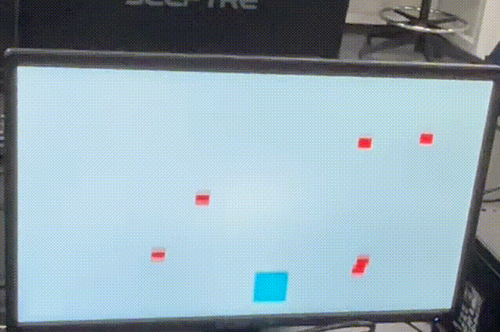

# DSD-Final-Lab-Project : Evade
Group work for Digital System Design, VHDL Projects for Nexys A7-100T FPGAs using Vivado

## Introduction
In _**Evade**_ you play as a 'car' whose horizontal position is controlled by a potentiometer. 
* **GOAL:** You must avoid obstacles as you accelerate down a road. 
* **SCORING:** The 7-segment display on the board increments based on the time spent until the player is hit. 
* **LOSING:** If the car gets hit by an obstacle, then the game will end.
* **INITIALIZING:** To start/restart the game, press the center button, _BTNC_, on the board.
  * Your score will be renewed and you will start at base speed

## Video of Game

## Attachments needed: 
* [NI Digilent Nexys A7-100T FPGA Trainer Board](https://store.digilentinc.com/nexys-a7-fpga-trainer-board-recommended-for-ece-curriculum/) 
* 5 k&Omega; Potentiometer
* 12-bit [analog-to-digital converter](https://en.wikipedia.org/wiki/Analog-to-digital_converter) (ADC)
  * [Pmod AD1](https://store.digilentinc.com/pmod-ad1-two-12-bit-a-d-inputs/) Connected to top pins of Pmod port JA (Section 10 of the [Reference Manual](https://reference.digilentinc.com/_media/reference/programmable-logic/nexys-a7/nexys-a7_rm.pdf))

## How to Run
1. Create six new source files of file type VHDL called clk_wiz_0, clk_wiz_0_clk_wiz, vga_sync, bat_n_ball, adc_if, and pong
* Create a new constraint file of file type XDC called pong
* Choose Nexys A7-100T board for the project
* Click 'Finish'
* Click design sources and copy the VHDL code from clk_wiz_0, clk_wiz_0_clk_wiz, vga_sync.vhd, bat_n_ball.vhd, adc_if.vhd, pong.vhd
* Click constraints and copy the code from pong.xdc

2. Run synthesis
3. Run implementation and open the implemented design
4. Generate bitstream, open hardware manager, and program device
Click 'Generate Bitstream'
Click 'Open Hardware Manager' and click 'Open Target' then 'Auto Connect'
Click 'Program Device' then xc7a100t_0 to download pong.bit to the Nexys A7-100T board
Push BTNC to start the game

## Modifications
We built upon the code provided, and the portions we created, for Lab 6, the Pong game. Some major functionalities were swapped:
- When an object hits the car, instead of incrementing the score counter, it will end the game
- When an object reaches the bottom of the screen, instead of ending the game, it will respawn in a new location

From Lab 6, we also used our score display code with the 7-segment display.
We also created eight total obstacles instead of just one ball, which run off the original collision detection and framework, and have the modified behaviors. Over time, the obstacles would also begin to travel more quickly, increasing the difficulty over time.
When implementing random respawns, we initially had an issue where the obstacles would respawn in similar areas and at similar intervals. 
To counter this, Owen used prime number multiplication to add uniqueness to each spawn.
### Core Changes
- Instantiate 8 Rocks with a uniform size and speed, but independent X and Y-Coordinates
- Further, we made an STD_LOGIC_VECTOR 'rock_on_screen' which reads '1' on an index if that is on the screen, and '0' if the rock has reached the bottom of the screen
- 'rock_on' is '1' at an index if the current pixel is looking at that rock, '0' if not
- When respawning the rocks, we use start_x as a pseudo-random value defined in a process later
  

- If a pixel is looking at any rock of the many, this becomes the equivalent logic for simple RGB values.

In order to continuously generate obstacles, we used a formula involving multiple factors, including score, the current position of the car and the obstacle, a prime number identifier, and a mod division:

This formula chooses new positions for each obstacle when they reappear.

## Process Summary
Christopher and Owen did the majority of the programming, Alex's work was on the original GitHub push highlighting ideas for how and where the new functionalities would be implemented and writing ReadMe file for the Repo.
There were two very different parts of this project's development. Chris originally took a very different direction with the code, creating a thread for each obstacle, and a system that would enable and disable them. 
Unfortunately, due to complications with how VHDL handles and announces concurrency issues, we went back to a more simplified approach that ran more closely to the original Lab 6, Pong, code.
#

  

